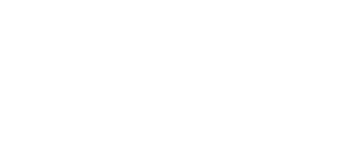

# ZooDietConverter 

[**ZooDietConverter**](https://zoonut.shinyapps.io/ZDNConverter/) is a Shiny-based R application designed to help zoo nutritionists convert nutrient data into standardized formats for analysis and comparison via [Zoo Diet Navigator](https://github.com/KaraWatts/ZooDietNavigator). The app allows users to upload food data, convert units, align nutrient names, and review the transformed dataset—all in a simple, interactive workflow.

---

## 🚀 Features

* Upload and process nutrient datasets in CSV format
* Reconfigure data for Zoo Diet Navigator using easy user-friendly converter
* Review and download the cleaned dataset
* Save presets to make future uploads even easier

---

## 🧰 Technologies

* [R](https://www.r-project.org/)
* [Shiny](https://shiny.posit.co/)
* [shinydashboard](https://rstudio.github.io/shinydashboard/)
* [DT](https://rstudio.github.io/DT/)

---

## 📆 Getting Started

### 🔄 Clone the Repository

```bash
git clone https://github.com/KaraWatts/ZooDietConverter.git
cd ZooDietConverter
```

### 🛠️ Install Dependencies

Make sure you have R (>= 4.0.0) and [RStudio](https://posit.co/download/rstudio-desktop/) installed.

Then, in RStudio or an R console:

```r
install.packages(c("shiny", "shinydashboard", "DT", "readxl", "dplyr", "writexl", "stringr"))
```

---

## ▶️ Run the App Locally

Open `app.R` in RStudio and click **Run App**, or run the following command in the R console:

```r
shiny::runApp()
```

The app will launch in your browser. Follow the step-by-step interface to upload, convert, and download your data.

---

## 🙌 Contributing

We welcome contributions from the community! Please read our [CONTRIBUTING.md](CONTRIBUTING.md) for guidelines on how to propose changes.

---

## 📁 Folder Structure

```
ZooDietConverter/
├── constants/               # Contains Excel files used for nutrient key, units, etc.
├── www/                     # Static resources like custom CSS (optional)
├── app.R                   # Main Shiny app entry point
├── README.md               # Project documentation
├── CONTRIBUTING.md         # Contribution guidelines
├── CODE_OF_CONDUCT.md      # Code of conduct for contributors
```

---

## 📢 Related Projects

[](https://github.com/KaraWatts/ZooDietNavigator)

Check out [Zoo Diet Navigator](https://github.com/KaraWatts/ZooDietNavigator), our parent app for exploring and comparing zoo diets.

---

## 🌍 License

This project is licensed under the MIT License. See the [LICENSE](LICENSE) file for details.

---

## 📜 Code of Conduct

Please note that this project is released with a [Contributor Code of Conduct](CODE_OF_CONDUCT.md).  
By participating in this project, you agree to abide by its terms.

---

## 📨 Contact

Have a question or suggestion? Feel free to [open an issue](https://github.com/KaraWatts/ZooDietConverter/issues) or reach out via the Discussions tab.

---

## 🐾 Acknowledgments

This project is developed to support nutrition work in zoos and wildlife facilities by making it easier to standardize and convert nutrient data.
